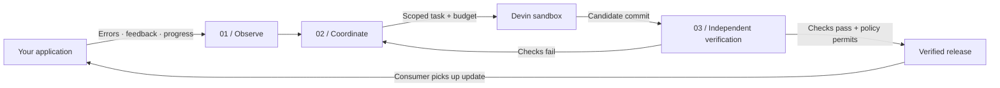

<div align="center">

# promote.

### You build it. Promote helps maintain it.

An engineering team for the solo developer.<br>
Connect what happens in your app to the agents that improve your code.

**Observe → Improve → Verify → Deliver**

[Explore the office](#an-office-you-can-read) · [How it works](#three-layers-one-maintenance-loop) · [Run locally](#run-locally) · [Build status](#where-we-are-today)

</div>

---

Solo developers are building more than ever. Every new app brings bugs to investigate, feedback to understand, dependencies to manage, and improvements to ship. The work continues long after the first launch.

**Promote is being built to take that maintenance loop off your plate.** It connects application evidence to an engineering agent, tracks the work, and independently checks the result before making a release available to your app. You set the scope and spending limits; Promote coordinates the work within them.

> **Active prototype.** Real chat intake, orchestration and Devin dispatch are implemented. The first real repair returned a candidate; the complete verification-to-release cycle is still pending. The reusable observability SDK and general deployment integrations are next steps.

## An office you can read


*The running local office, captured September 19, 2026. Its stations and ticker reflect controller state. Generated assets shown here are local previews and are not bundled with a fresh clone.*

The office gives the work a place: a backlog to prioritize, an engineering desk, a verification station, a strategy wall and a finance vault. Open the ticker to see the objective, blocker and next action in plain language.


*The live activity view from the same local service. Screenshots are observations of this instance, not a claim that a repair has shipped.*

| You want to know… | Promote shows… |
| --- | --- |
| What are we trying to achieve? | The current objective and repair stages |
| Who is doing something? | Role status, local processes and remote Devin work |
| Why hasn't it shipped? | The blocker and the next required action |
| What happens after this? | Prioritized proposals and the work queue |
| What is it costing? | Reported ACUs, reserved limits and labelled dollar estimates |

The office also has an **Explore demo** mode with an illustrative repair story. Demo activity is labelled separately from live records.

## Three layers. One maintenance loop.

| Layer | Responsibility | Implementation today |
| --- | --- | --- |
| **01 · Observe** | Capture failures, user feedback and execution context inside your project. | Xarts Chat emits durable run records, feedback and progress. A general installable SDK is planned. |
| **02 · Improve** | Turn evidence into scoped work and coordinate an engineering team. | Promote triages and schedules locally; Devin performs authorized engineering work in its remote sandbox. |
| **03 · Deliver** | Independently verify the candidate and deliver an accepted update. | Xarts package build, consumer checks, request replay and registry activation are wired. Full real-loop acceptance remains pending. |



**Promote coordinates the team. Devin supplies the engineering execution environment.** Today, triage and analyst roles use deterministic local rules. Semantic research and model-backed feature discovery are still planned.

The delivery target currently implemented is a **verified package registry**. Deploying arbitrary applications to hosting providers is a future integration, not an existing universal deploy button.

## From a bad chart to a better release

Our first integration is **Xarts**, a chart library, connected to a separate chat application.

1. A user requests a chart. The chat executes SQL against its dataset, renders with Xarts and records the outcome.
2. Render checks and user feedback enter Promote's durable inbox. Repeated signals become proposals for investigation.
3. An authorized repair becomes a Devin task with a named repository, permitted paths and an ACU ceiling.
4. Devin returns a candidate branch. Promote checks the exact commit and runs independent build, consumer and original-request checks.
5. Once the required checks and release policy pass, Promote activates the package. Subsequent chat requests can use that verified version.

**Steps 1–3 have been exercised with real activity, and Devin returned a candidate.** The verification and activation path is implemented, but the first complete package run was interrupted by the local Docker environment. No repaired Xarts release has been activated.

| Repository | What it owns |
| --- | --- |
| **[promote](https://github.com/miguelsuredasuau/promote)** · public | Orchestration, Devin integration, verification, registry, office and asset Studio |
| **[xarts-chat](https://github.com/miguelsuredasuau/xarts-chat)** · public | The chart-building chat, SQL tools, feedback and release consumption |
| **[visx-anlak](https://github.com/miguelsuredasuau/visx-anlak)** · private | The chart library that receives candidate fixes |

The Studio in this repository builds **office assets**. The chart builder lives in `xarts-chat`.

## Autonomy with a scope

- **Evidence before action.** User feedback informs proposals; independent checks establish whether a repair works.
- **Bounded engineering.** Dispatch requires an approved task, allowed paths, a budget and applicable funding conditions. A provider key alone does not authorize spending.
- **Independent verification.** The engineering agent's success message is a claim to check. Promote evaluates the frozen candidate commit before release.
- **Durable work.** Intake, work claims and events persist. Ambiguous paid requests are reconciled instead of blindly resent.
- **Visible accounting.** Reserved ceilings and reported usage are distinct. Dollar estimates are labelled, and provider usage can arrive late.

A ten-minute heartbeat reviews project activity. Scheduling prioritizes candidate verification and reliability, with every fifth eligible assessment reserved for discovery. The heartbeat does not grant itself new scope or spending authority.

## Run locally

Use **Node 22.22.1** and **pnpm 10.33.0**.

```sh
git clone https://github.com/miguelsuredasuau/promote.git
cd promote
pnpm install --frozen-lockfile
pnpm check
pnpm dev
```

Open **http://127.0.0.1:4310** for the office or **http://127.0.0.1:4310/activity** for the operations journal. The service can start without the private Xarts source or provider credentials; live engineering requires the configuration below.

<details>
<summary><strong>Connect the Xarts integration and engineering provider</strong></summary>

Configure an external checkout and the chat's outbox:

```sh
PROMOTE_PROJECT_PATH=/absolute/path/to/visx-anlak \
PROMOTE_CHAT_OUTBOX=/absolute/path/to/xarts-chat/runs/outbox \
pnpm dev
```

Store `DEVIN_API_KEY` and `DEVIN_ORG_ID` in an ignored `.env` file. `FAL_KEY` is used by the optional asset Studio. Follow [Devin configuration and spending](docs/devin-operations.md) to configure the task mandate and budget before dispatch.

The chat and Promote currently exchange files through configured local paths. Remote hosting requires shared storage or an authenticated transport; cloning the repositories does not copy the running system's evidence or credentials. See the chat's [hosting handoff](https://github.com/miguelsuredasuau/xarts-chat/blob/main/docs/HOSTING.md).

Independent candidate execution requires Docker and the configured verification environment. Follow [Xarts delivery](docs/xarts-delivery.md) for the exact setup and acceptance boundaries.

</details>

<details>
<summary><strong>Explore the asset Studio</strong></summary>

The optional Studio provides office concept generation, model inspection and visual review on port **4311**. Generated assets and review history live under ignored local storage. A clone includes the viewer and source, not the locally generated asset collection.

See [Studio setup and current limits](studio/README.md). Asset generation uses its own provider and spending controls.

</details>

## Where we are today

Status recorded **September 19, 2026**. Implementation and a completed live acceptance run are tracked separately.

| Capability | Status |
| --- | --- |
| Durable chat intake, feedback and progress journals | Implemented for Xarts Chat |
| Proposal triage, role queue and ten-minute heartbeat | Implemented with local rules |
| Scoped Devin dispatch and ACU reservations | Implemented; one real repair candidate returned |
| 3D office, ticker and readable activity journal | Implemented |
| Isolated Xarts verification and registry activation | Wired; first full real cycle pending |
| Reusable project observability SDK | Planned |
| Model-backed research and feature discovery | Planned |
| General application deployment integrations | Planned |

Next milestones: complete the real Xarts repair-to-release loop, extract a reusable integration SDK, then connect a second project to prove the adapter boundary works beyond charts.

For detailed evidence, see [implementation status](docs/implementation-status.json), [acceptance plan](docs/implementation-plan.md) and [integration progress](docs/integration-progress.md).

## Build on Promote

The core owns incidents, policy, budgets, evidence and releases. Project adapters define reproduction, evaluation and packaging; engineering adapters connect execution providers. Devin and Xarts are the first concrete integrations.

| Area | Source | Read next |
| --- | --- | --- |
| Controller and persistence | [`server/`](server/) | [Storage and lifecycle](docs/controller-storage.md) |
| Contracts and adapter interfaces | [`contracts/`](contracts/) | [Contract reference](docs/contracts.md) |
| Providers and project checks | [`adapters/`](adapters/) | [Repository boundaries](docs/repository-boundaries.md) |
| Role instructions | [`prompts/`](prompts/) | [Orchestration behavior](docs/orchestrator-runtime.md) |
| Office and activity UI | [`web/`](web/) | [Operator console](docs/operator-console.md) |
| Asset builder and review | [`studio/`](studio/) | [Studio guide](studio/README.md) |

Run `pnpm check` for the publication-source check, TypeScript checks and tests. Docker integration checks have additional prerequisites documented in the delivery guides.

<details>
<summary><strong>Source availability and local state</strong></summary>

This repository is public; an open-source license has not yet been selected. Package publication remains disabled.

Credentials, customer data, provider transcripts, private chart implementation, generated asset files and local runtime state are excluded from the repository. The screenshots above document the local UI; they do not bundle its underlying generated models. Keep `.env` and `.local/` outside commits.

</details>

---

<div align="center">

**Build the next thing. Keep this one improving.**

</div>
