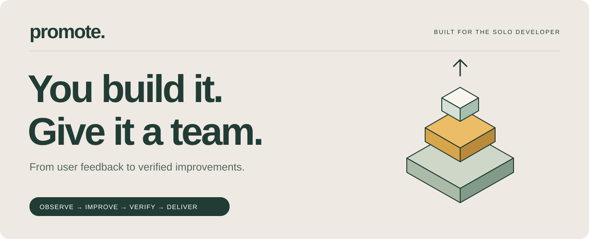
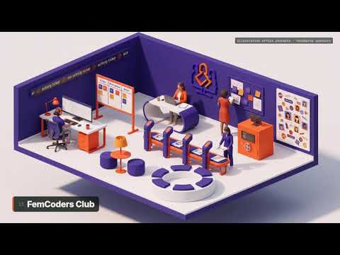
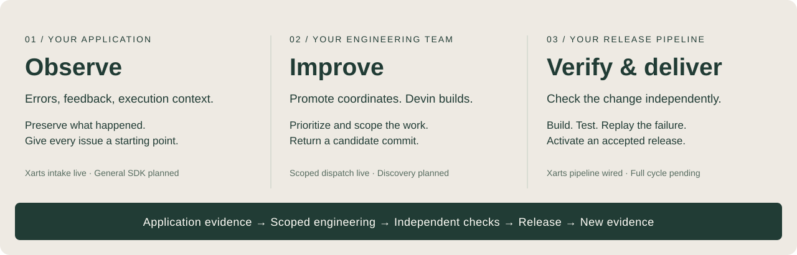
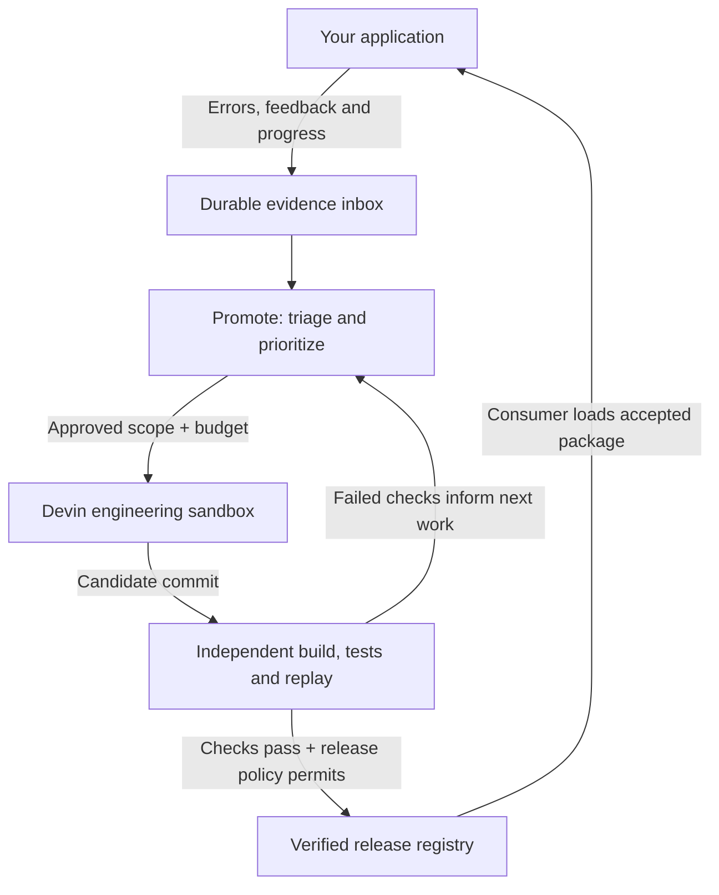
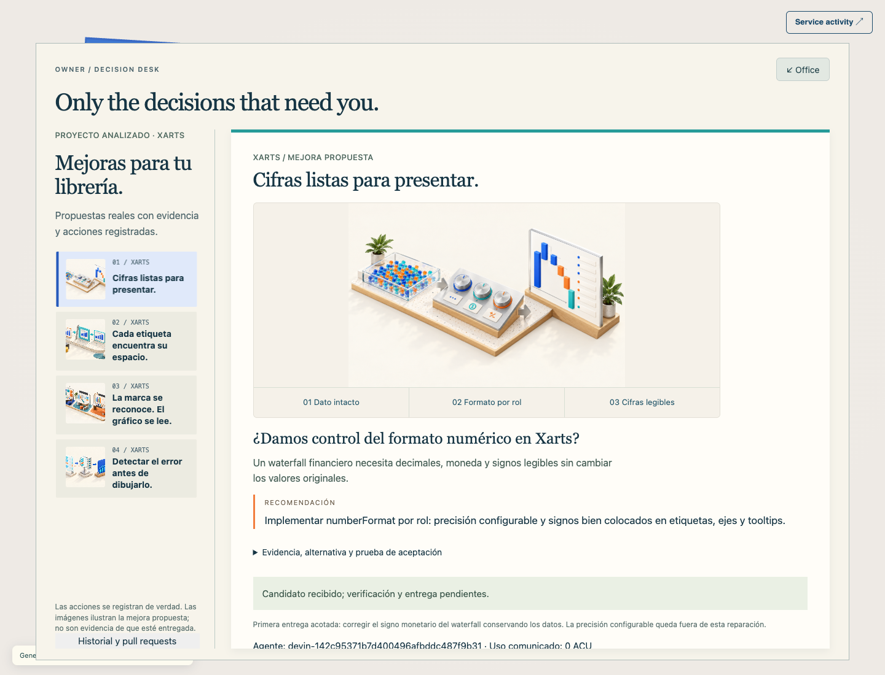
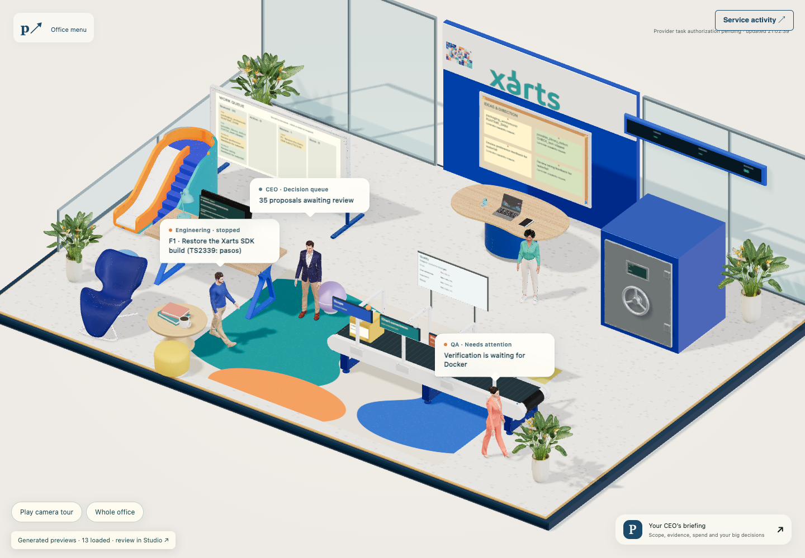
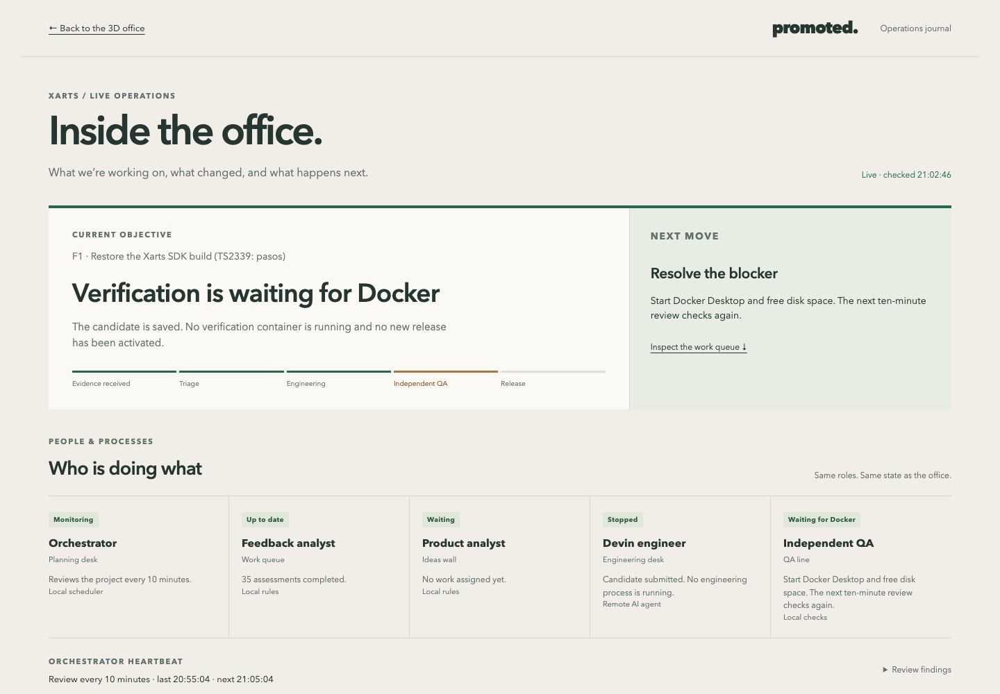

<div align="center">



**An engineering team for the solo developer.**

[**▶ Watch the film**](https://youtu.be/nC2f0_lAhSY) &nbsp; · &nbsp; [Xarts + Promote explained](docs/projects.md) &nbsp; · &nbsp; [The three layers](#the-three-layers) &nbsp; · &nbsp; [See the product](#a-workplace-for-the-work) &nbsp; · &nbsp; [Run locally](#run-locally)

</div>

## Building got faster. Maintenance stayed with you.

You can launch an app in a weekend. Then come the bug reports, broken builds, feature requests and releases. Each new project adds another codebase that needs your attention.

**Promote connects what happens in your app to the engineering work that keeps it improving.** It gathers evidence, coordinates scoped repairs with Devin, and checks candidates independently before releasing an update. You set the priorities, boundaries and budget.

### Meet Promote

<a href="https://youtu.be/nC2f0_lAhSY">
  
</a>

<p align="center"><a href="https://youtu.be/nC2f0_lAhSY"><strong>▶ Watch the film on YouTube</strong></a></p>

> **Development preview.** Real intake, orchestration and Devin dispatch are implemented. A real repair has returned a candidate. Its complete verification-to-release run is pending; the general SDK and hosting integrations are planned.

## The three layers



**01 · An observability adapter in your project.** Capture errors, user feedback and execution context so the team can investigate what actually happened. Today, Xarts Chat sends durable records and progress journals through local files. An installable SDK and authenticated remote transport are next steps.

**02 · An engineering team, coordinated by Promote.** Triage signals, identify work and dispatch a bounded task to Devin's sandbox. Today, scheduling and analyst roles use local rules; Devin performs the remote engineering work. Model-backed research and feature discovery are planned.

**03 · A pipeline from candidate to accepted update.** Check the exact commit, build it, run independent tests and replay the original failure. The current target is Xarts package delivery through a verified registry. General application deployment comes later.

<details>
<summary><strong>Follow the architecture: feedback, repair, verification, release</strong></summary>



Promote owns orchestration and release decisions. Engineering providers return candidates; project adapters define the checks those candidates must pass.

</details>

## A workplace for the work

### Product direction you can see

Four illustrated proposals explore what Promote could become: connect a project, delegate maintenance, turn feedback into priorities, and deliver safely. Open the [visual decision demo](http://127.0.0.1:4310/?demo=decisions) after starting the local server. Choices are illustrative and never approve real work.



Generated with GPT Image 2.5 through fal, using the office’s art direction. [How the demo and generation work](docs/visual-decisions.md).

The **3D office** makes the team visible. The **operations journal** makes its decisions readable. Both reflect the same controller state.



*Five workstations. One shared view of the work. Click the in-room ticker to open the operations journal.*



*The objective, the blocker, the next move—and who is doing what. This live capture shows verification waiting for Docker, with no repaired release activated.*

| Surface | What it makes visible |
| --- | --- |
| **Backlog & strategy** | Incoming evidence, assessed proposals and upcoming work |
| **Engineering & QA** | The repair task, candidate and independent verification stages |
| **Finance & activity** | Reserved budgets, reported usage, decisions and blockers |

Screenshots were captured on **September 19, 2026**. Generated office assets are local previews, not bundled models. **Explore demo** provides a separately labelled illustrative repair story.

## The first proving ground: Xarts

A user asks for a chart. The app queries its SQLite dataset, renders the result, and records tool activity and feedback. When something fails, Promote has the request and its evidence to investigate.

The intended payoff is concrete: **the same request works with a verified, repaired chart package.**

| Stage | Evidence so far |
| --- | --- |
| **Receive** | Real chat runs, feedback and progress reach Promote. |
| **Investigate** | Signals are grouped into proposals and scoped work. |
| **Repair** | One real Devin session returned a candidate. |
| **Verify** | Build, standalone consumer checks and SQL request replay are wired; the full package run was interrupted by Docker. |
| **Release** | Registry activation is implemented. No repaired release has been activated. |

This integration spans three repositories:

- **[promote](https://github.com/miguelsuredasuau/promote)** — orchestration, Devin, verification, registry, office and asset Studio.
- **[xarts-chat](https://github.com/miguelsuredasuau/xarts-chat)** — the chart chat, SQL tools, feedback and release consumption.
- **[visx-anlak](https://github.com/miguelsuredasuau/visx-anlak)** *(private)* — the chart library that receives repairs.

## You set the operating boundaries

| Control | Behavior |
| --- | --- |
| **Scope** | An engineering task names its repository and permitted paths. New scope needs authorization. |
| **Spend** | ACU ceilings are reserved before dispatch. Reported usage and estimated dollar cost remain distinct. |
| **Acceptance** | Independent checks evaluate a frozen candidate commit before release. |
| **Continuity** | Evidence and work claims persist. Ambiguous paid requests require reconciliation. |
| **Priorities** | A ten-minute heartbeat reviews activity. Verification and reliability lead, with every fifth eligible assessment reserved for discovery. |

A provider credential connects the service; the task mandate determines what it may do. [Read the operating model →](docs/orchestrator-runtime.md)

## Run locally

Use **Node 22.22.1** and **pnpm 10.33.0**.

```sh
git clone https://github.com/miguelsuredasuau/promote.git
cd promote
pnpm install --frozen-lockfile
pnpm check
pnpm dev
```

Open **http://127.0.0.1:4310** for the office or **http://127.0.0.1:4310/activity** for the operations journal. The service can start without the private Xarts source or provider credentials; live engineering requires the configuration below.

<details>
<summary><strong>Connect the Xarts integration and engineering provider</strong></summary>

Configure an external checkout and the chat's outbox:

```sh
PROMOTE_PROJECT_PATH=/absolute/path/to/visx-anlak \
PROMOTE_CHAT_OUTBOX=/absolute/path/to/xarts-chat/runs/outbox \
pnpm dev
```

Store `DEVIN_API_KEY` and `DEVIN_ORG_ID` in an ignored `.env` file. `FAL_KEY` is used by the optional asset Studio. To merge pull requests from the owner's desk, add `PROMOTE_GITHUB_TOKEN` (a fine-grained token with *Contents: read/write* and *Pull requests: read/write* on the listed repositories; merges are attributed to it) and `PROMOTE_MERGE_REPOS` (comma-separated `owner/repo` allowlist). The desk merges only at the exact reviewed head, only when every check on it passed (or none is configured); when a branch conflicts with its base it merges the base into the branch in an isolated clone, takes the base's version of clerical files (lockfiles, snapshots, goldens, generated schemas) for the branch's QA to regenerate, pushes, and leaves any overlapping source conflict to you. Follow [Devin configuration and spending](docs/devin-operations.md) to configure the task mandate and budget before dispatch.

The chat and Promote currently exchange files through configured local paths. Remote hosting requires shared storage or an authenticated transport; cloning the repositories does not copy the running system's evidence or credentials. See the chat's [hosting handoff](https://github.com/miguelsuredasuau/xarts-chat/blob/main/docs/HOSTING.md).

Independent candidate execution requires Docker and the configured verification environment. Follow [Xarts delivery](docs/xarts-delivery.md) for the exact setup and acceptance boundaries.

</details>

<details>
<summary><strong>Explore the asset Studio</strong></summary>

The optional Studio provides office concept generation, model inspection and visual review on port **4311**. Generated assets and review history live under ignored local storage. A clone includes the viewer and source, not the locally generated asset collection.

See [Studio setup and current limits](studio/README.md). Asset generation uses its own provider and spending controls.

</details>

## Quality review · Norma

Norma is integrated into Devin’s engineering instructions and Promote’s independent candidate review in **advisory mode**. Reviews record the candidate commit, file hashes and observed rule snapshots; incomplete coverage stays **pending**. Devin requires its own authenticated MCP connection.

**Updated September 20, 2026:** diagnostic inputs now receive schema validation, records that break classification are quarantined, and a failed orchestration cycle no longer prevents the scheduled review from running. Intake and triage changes have behavioral tests; the scheduler change has been inspected in code. None establishes verified closure of Norma’s earlier findings.

| Recorded review | Scope | Findings | Coverage |
| --- | --- | ---: | --- |
| September 19 · `464acab` | Chat intake, Devin adapter, release registry | 26 | Reduced |
| September 20 · `2724df6` | Engineering dispatch, orchestrator, orchestrator tests | 18 | Incomplete · pending |

The scopes differ, so these counts are **not a before/after improvement score**. The latest recorded Norma review predates the subsequent fixes. A same-scope recheck is still needed to establish which findings are resolved; no completed full-repository scan is recorded, and provider cost remains unknown.

[**Changes, evidence and remaining work →**](docs/reviews/norma-follow-up-2026-09-20.md) · [Setup and limits](docs/integrations/norma.md) · [Original pilot](docs/reviews/norma-pilot-2026-09-19.md)

## What comes next

The next milestones turn a concrete integration into a reusable product:

- [ ] **Close the real repair loop.** Complete isolated verification and activate the first repaired Xarts release.
- [ ] **Extract the project SDK.** Package event capture, feedback, progress and remote connectivity.
- [ ] **Connect a second project.** Prove the integration works beyond charts.
- [ ] **Expand discovery.** Add model-backed research and feature assessment.
- [ ] **Extend delivery.** Connect verified changes to application hosting workflows.

[Implementation evidence](docs/implementation-status.json) · [Acceptance plan](docs/implementation-plan.md) · [Integration progress](docs/integration-progress.md)

<details>
<summary><strong>Developer map</strong></summary>

| Component | Source | Guide |
| --- | --- | --- |
| Controller, queue and persistence | [`server/`](server/) | [Storage](docs/controller-storage.md) |
| Contracts and adapter interfaces | [`contracts/`](contracts/) | [Contracts](docs/contracts.md) |
| Devin and Xarts integrations | [`adapters/`](adapters/) | [Repository boundaries](docs/repository-boundaries.md) |
| Role instructions | [`prompts/`](prompts/) | [Orchestration](docs/orchestrator-runtime.md) |
| Office and activity journal | [`web/`](web/) | [Operator console](docs/operator-console.md) |
| Office asset builder | [`studio/`](studio/) | [Studio guide](studio/README.md) |

`pnpm check` runs the publication-source check, TypeScript checks and tests. Docker integration checks have additional prerequisites in the delivery guides. The asset Studio builds office visuals; the chart builder lives in `xarts-chat`.

</details>

<details>
<summary><strong>Source availability and local state</strong></summary>

This repository is public; an open-source license has not yet been selected. Package publication remains disabled.

Credentials, customer data, provider transcripts, private chart implementation, generated model files and runtime state are excluded from Git. The published screenshots document the local UI. Keep `.env` and `.local/` outside commits.

</details>

---

<div align="center">

### Your next launch deserves a maintenance plan.

[**Watch Promote in action ↗**](https://youtu.be/nC2f0_lAhSY) &nbsp; · &nbsp; [**Run it locally →**](#run-locally)

</div>

### Exploratory application testing

**Office menu → Explore & test** commissions one bounded Devin sandbox session at a reviewed commit. Reports, coverage, findings and reported ACU persist in SQLite; findings feed discovery for independent reproduction. The first profile tests xarts-chat's UI with synthetic fixtures and no paid chat calls. See [the workflow and its limits](docs/EXPLORATORY-TESTING.md).
