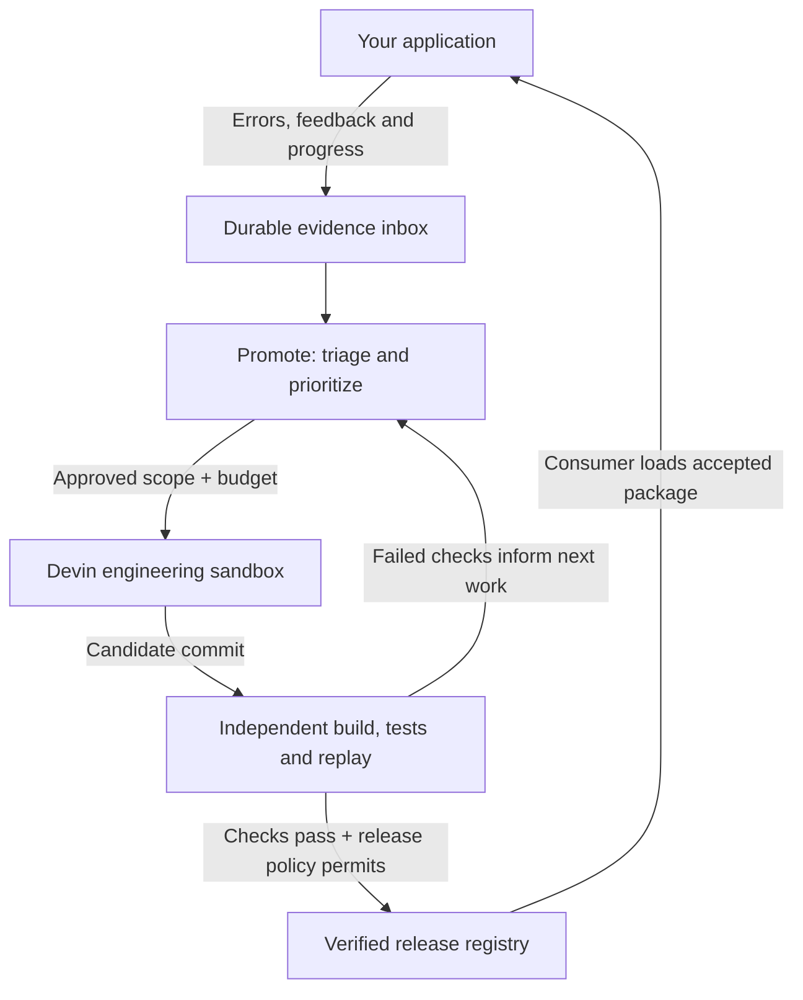
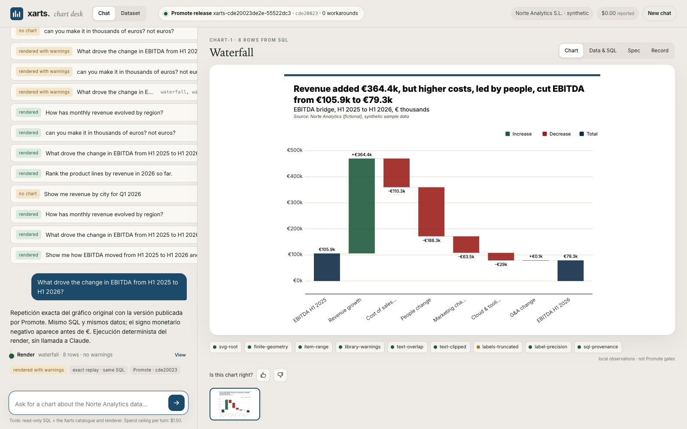

<div align="center">


**An engineering team for the solo developer.**

Built for **Hackbarna 2026**, during the weekend of **September 19–20, 2026**, with **Devin, OpenAI Codex and Claude Code**, under human direction and review. [MIT licensed](LICENSE).

[**▶ Watch the film**](https://www.youtube.com/watch?v=8T7RxbxjJbU) &nbsp; · &nbsp; [Xarts + Promote explained](docs/projects.md) &nbsp; · &nbsp; [The three layers](#the-three-layers) &nbsp; · &nbsp; [See the product](#a-workplace-for-the-work) &nbsp; · &nbsp; [Run locally](#run-locally)

</div>

## Building got faster. Maintenance stayed with you.

You can launch an app in a weekend. Then come the bug reports, broken builds, feature requests and releases. Each new project adds another codebase that needs your attention.

**Promote connects what happens in your app to the engineering work that keeps it improving.** It gathers evidence, coordinates scoped repairs with Devin, and checks candidates independently before releasing an update. You set the priorities, boundaries and budget.

### Meet Promote

<a href="https://www.youtube.com/watch?v=8T7RxbxjJbU">
  
</a>

<p align="center"><a href="https://www.youtube.com/watch?v=8T7RxbxjJbU"><strong>▶ Watch the film on YouTube</strong></a></p>

> **Development preview.** Real intake, orchestration and Devin dispatch are implemented. One bounded Xarts repair completed independent verification, local registry activation and deterministic chat replay; the general SDK and hosting integrations are planned.

## The three layers


**01 · An observability adapter in your project.** Capture errors, user feedback and execution context so the team can investigate what actually happened. Today, Xarts Chat sends durable records and progress journals through local files. An installable SDK and authenticated remote transport are next steps.

**02 · An engineering team, coordinated by Promote.** Triage signals, identify work and dispatch a bounded task to Devin's sandbox. Today, scheduling and analyst roles use local rules; Devin performs the remote engineering work. Model-backed research and feature discovery are planned.

**03 · A pipeline from candidate to accepted update.** Check the exact commit, build it, run independent tests and replay the original failure. The current target is Xarts package delivery through a verified registry. General application deployment comes later.

<details>
<summary><strong>Follow the architecture: feedback, repair, verification, release</strong></summary>



Promote owns orchestration and release decisions. Engineering providers return candidates; project adapters define the checks those candidates must pass.

</details>

## A workplace for the work

### Product direction you can see

Four illustrated proposals explore improvements to **Xarts, the chart library being analyzed**: numeric formatting, adaptive labels, accessible themes and specification preflight. Each proposal names its documented evidence and acceptance checks. Open the [Xarts improvement desk](http://127.0.0.1:4310/?improvements=xarts) after starting the local server. Planning actions persist real decisions. Scoped execution dispatches Devin only with an exact task mandate and ACU ceiling; unprepared proposals explain their blockers. Images illustrate proposed outcomes, not completed work.


Generated with GPT Image 2.5 through fal, using the office’s art direction. [How the demo and generation work](docs/visual-decisions.md).

**One real loop completed:** Devin corrected negative currency labels in Xarts waterfall charts (`€-110.3k` → `-€110.3k`). Promote built and independently checked the package, activated release `xarts-cde20023de2e-55522dc3`, and replayed the original SQL-backed chart through Xarts Chat with identical data and zero workarounds. This delivers the sign correction, not the whole number-format feature. [Evidence and recording handoff](docs/xarts-video-loop.md).



The **3D office** makes the team visible. The **operations journal** makes its decisions readable. Both reflect the same controller state.


*Five workstations. One shared view of the work. Click the in-room ticker to open the operations journal.*


*The objective, the blocker, the next move—and who is doing what. This live capture shows verification waiting for Docker, with no repaired release activated.*

| Surface | What it makes visible |
| --- | --- |
| **Backlog & strategy** | Incoming evidence, assessed proposals and upcoming work |
| **Engineering & QA** | The repair task, candidate and independent verification stages |
| **Finance & activity** | Reserved budgets, reported usage, decisions and blockers |

The office and activity screenshots above are historical captures from **September 19, 2026**. The activity blocker shown above is not the latest release status. Generated office assets are local previews, not bundled models. **Explore demo** provides a separately labelled illustrative repair story.

## The first proving ground: Xarts

A user asks for a chart. The app queries its SQLite dataset, renders the result, and records tool activity and feedback. When something fails, Promote has the request and its evidence to investigate.

The intended payoff is concrete: **the same request works with a verified, repaired chart package.**

| Stage | Evidence so far |
| --- | --- |
| **Receive** | Real chat runs, feedback and progress reach Promote. |
| **Investigate** | Signals are grouped into proposals and scoped work. |
| **Repair** | One real Devin session returned a candidate. |
| **Verify** | The bounded waterfall currency-sign repair passed independent checks and deterministic SQL replay. See [recorded evidence](docs/xarts-video-loop.md). |
| **Release** | The repaired package was activated in the local registry and consumed by Xarts Chat. The repair was merged into Xarts `main` on September 20, 2026; this does not claim an npm publication. |

This integration spans three repositories:

- **[promote](https://github.com/miguelsuredasuau/promote)** — orchestration, Devin, verification, registry, office and asset Studio.
- **[xarts-chat](https://github.com/miguelsuredasuau/xarts-chat)** — the chart chat, SQL tools, feedback and release consumption.
- **[visx-anlak](https://github.com/miguelsuredasuau/visx-anlak)** *(private)* — the chart library that receives repairs.

## You set the operating boundaries

| Control | Behavior |
| --- | --- |
| **Scope** | An engineering task names its repository and permitted paths. New scope needs authorization. |
| **Spend** | ACU ceilings are reserved before dispatch. Reported usage and estimated dollar cost remain distinct. |
| **Acceptance** | Independent checks evaluate a frozen candidate commit before release. |
| **Continuity** | Evidence and work claims persist. Ambiguous paid requests require reconciliation. |
| **Priorities** | A ten-minute heartbeat reviews activity. Verification and reliability lead, with every fifth eligible assessment reserved for discovery. |

A provider credential connects the service; the task mandate determines what it may do. [Read the operating model →](docs/orchestrator-runtime.md)

## Run locally

Use **Node 22.22.1** and **pnpm 10.33.0**.

```sh
git clone https://github.com/miguelsuredasuau/promote.git
cd promote
pnpm install --frozen-lockfile
pnpm check
pnpm dev
```

Open **http://127.0.0.1:4310** for the office or **http://127.0.0.1:4310/activity** for the operations journal. The service can start without the private Xarts source or provider credentials; live engineering requires the configuration below.

<details>
<summary><strong>Connect the Xarts integration and engineering provider</strong></summary>

Configure an external checkout and the chat's outbox:

```sh
PROMOTE_PROJECT_PATH=/absolute/path/to/visx-anlak \
PROMOTE_CHAT_OUTBOX=/absolute/path/to/xarts-chat/runs/outbox \
pnpm dev
```

Store `DEVIN_API_KEY` and `DEVIN_ORG_ID` in an ignored `.env` file. `FAL_KEY` is used by the optional asset Studio. To merge pull requests from the owner's desk, add `PROMOTE_GITHUB_TOKEN` (a fine-grained token with *Contents: read/write* and *Pull requests: read/write* on the listed repositories; merges are attributed to it) and `PROMOTE_MERGE_REPOS` (comma-separated `owner/repo` allowlist). The desk merges only at the exact reviewed head, only when every check on it passed (or none is configured); when a branch conflicts with its base it merges the base into the branch in an isolated clone, takes the base's version of clerical files (lockfiles, snapshots, goldens, generated schemas) for the branch's QA to regenerate, pushes, and leaves any overlapping source conflict to you. Follow [Devin configuration and spending](docs/devin-operations.md) to configure the task mandate and budget before dispatch.

The chat and Promote currently exchange files through configured local paths. Remote hosting requires shared storage or an authenticated transport; cloning the repositories does not copy the running system's evidence or credentials. See the chat's [hosting handoff](https://github.com/miguelsuredasuau/xarts-chat/blob/main/docs/HOSTING.md).

Independent candidate execution requires Docker and the configured verification environment. Follow [Xarts delivery](docs/xarts-delivery.md) for the exact setup and acceptance boundaries.

</details>

<details>
<summary><strong>Explore the asset Studio</strong></summary>

The optional Studio provides office concept generation, model inspection and visual review on port **4311**. Generated assets and review history live under ignored local storage. A clone includes the viewer and source, not the locally generated asset collection.

**September 20 update:** Studio now includes a persistent **Integration review** stage: placement and duplicate assets, six workstation zooms and returns, native-surface readability, movement, browser loading and local frame pacing. Evidence is bound to the office code and installed asset manifest; changes invalidate earlier passes. Four new Xarts previews (lounge, engineer, vault and slide), chart-inspired decoration and a single-chair replacement path are integrated locally.

Open `http://127.0.0.1:4311/#integration` for the review and screenshots. The checks describe the tested local desktop configuration, not universal visual perfection, mobile performance or collision simulation. Source and workflow are public; generated models, SQLite records and the local before/after video handoff remain private local artifacts.

See [Studio setup and current limits](studio/README.md). Asset generation uses its own provider and spending controls.

</details>

## Quality review · Norma

[**Defend your code — two-minute explanation and scan/fix/rescan evidence**](defense.md)

**Repository-wide findings remain unresolved.** A user-provided Norma dashboard summary reports **450 issues and a 55/100 score**. A supplied export contains **121 unique findings**: 118 from Prompts Analysis and 3 from Agentic Rules Analyzer. The export and dashboard have different category totals and cannot yet be reconciled to one scan; the export contains no commit SHA or scan ID.

The earlier **zero findings** result applies only to a ten-file code Livecheck with incomplete rule coverage. It does **not** clear the repository scan, prompt analysis, agentic review or production-readiness score. The 121 exported findings concern 15 other paths, none of which was in that ten-file review.

The bounded remediation remains useful and passed 274 tests (5 skipped) at its recorded commit. Overall closure requires contextual triage of the broader findings and fresh, comparable scan evidence. No repository-wide pass is claimed.

[**Reconciled scopes, counts and priorities →**](docs/reviews/norma-scope-reconciliation-2026-09-20.md) · [Bounded code-review evidence](docs/reviews/norma-zero-findings-2026-09-20.md) · [Integration and limits](docs/integrations/norma.md)

<details>
<summary><strong>Developer map</strong></summary>

[Implementation evidence](docs/implementation-status.json) · [Acceptance plan](docs/implementation-plan.md) · [Integration progress](docs/integration-progress.md)

| Component | Source | Guide |
| --- | --- | --- |
| Controller, queue and persistence | [`server/`](server/) | [Storage](docs/controller-storage.md) |
| Contracts and adapter interfaces | [`contracts/`](contracts/) | [Contracts](docs/contracts.md) |
| Devin and Xarts integrations | [`adapters/`](adapters/) | [Repository boundaries](docs/repository-boundaries.md) |
| Role instructions | [`prompts/`](prompts/) | [Orchestration](docs/orchestrator-runtime.md) |
| Office and activity journal | [`web/`](web/) | [Operator console](docs/operator-console.md) |
| Office asset builder | [`studio/`](studio/) | [Studio guide](studio/README.md) |

`pnpm check` runs the publication-source check, TypeScript checks and tests. Docker integration checks have additional prerequisites in the delivery guides. The asset Studio builds office visuals; the chart builder lives in `xarts-chat`.

</details>

<details>
<summary><strong>Source availability and local state</strong></summary>

Promote source code is licensed under the [MIT License](LICENSE). Package publication remains disabled. This license does not relicense the separate Xarts repository, brand marks, third-party dependencies or externally generated assets; their respective rights and terms remain applicable.

Credentials, customer data, provider transcripts, private chart implementation, generated model files and runtime state are excluded from Git. The published screenshots document the local UI. Keep `.env` and `.local/` outside commits.

</details>

---

<div align="center">

### Your next launch deserves a maintenance plan.

[**Watch Promote in action ↗**](https://www.youtube.com/watch?v=8T7RxbxjJbU) &nbsp; · &nbsp; [**Run it locally →**](#run-locally)

</div>

### Exploratory application testing

**Office menu → Explore & test** commissions one bounded Devin sandbox session at a reviewed commit. Reports, coverage, findings and reported ACU persist in SQLite; findings feed discovery for independent reproduction. The first profile tests xarts-chat's UI with synthetic fixtures and no paid chat calls. See [the workflow and its limits](docs/EXPLORATORY-TESTING.md).

## AI development and disclaimer

Promote was developed for **Hackbarna 2026, September 19–20**, using **Devin, OpenAI Codex and Claude Code**, under human direction and review. Code, documentation and visual assets may contain AI-generated errors or omissions. Mentioning these tools does not imply endorsement, certification or a guarantee from Cognition, OpenAI or Anthropic.

The software is provided **as is**, without warranties, under the [MIT License](LICENSE), whose standard warranty and liability exclusions apply. To the fullest extent permitted by applicable law, the authors and contributors disclaim liability arising from use of the project, including generated code or assets, autonomous actions, third-party services, provider charges, data loss, security incidents, interruptions and inaccurate outputs. Nothing excludes liability that applicable law does not allow to be excluded.

Users are responsible for reviewing outputs, permissions, budgets, credentials and third-party terms before operating or deploying the system. A successful test or recorded review is limited to its stated scope and does not guarantee future behavior.
