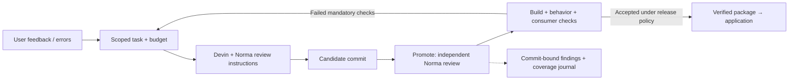

# Promote × Norma — quality inside the agent loop

**An audit tells you what needs fixing. Promote puts an engineering team on it.**

Promote gives your repository an AI CEO: user feedback becomes scoped work, Devin proposes a change, and an independent controller checks the candidate before delivery. Norma is embedded in that workflow—both in Devin’s engineering instructions and in Promote’s candidate review.

**The submission is Promote. The real project it maintains is Xarts (`visx-anlak`).** Built for Hackbarna 2026, September 19–20.

## The difference: quality travels with the change

A repository audit is valuable evidence about a moment in time. An autonomous engineering system needs that evidence at the moment an agent proposes its next change—and again when the next candidate arrives.

Promote connects those two needs. Instead of leaving a developer to translate an audit into work and reconcile the result, it provides the engineering workflow around the review:

| Embedded capability | Practical benefit |
| --- | --- |
| **Norma instructions inside Devin’s task** | The engineer is instructed to load applicable rules, review changed files, fix and recheck, and return a structured quality report. |
| **A separate controller review** | Promote reads the frozen candidate’s Git blobs and calls Norma independently. The coding agent’s assessment is not its own release approval. |
| **Commit and file-hash binding** | Findings belong to the exact candidate being considered, rather than an ambiguous “latest version.” |
| **Persisted evidence in the activity journal** | Findings, coverage, provenance and blockers remain available alongside the engineering work. |
| **Build, behavioral and consumer gates** | Static review sits alongside executable evidence that the resulting package works. Failed mandatory checks inform the next engineering attempt. |
| **Scope and budget boundaries** | Quality work stays within the authorized task; a finding does not grant permission to rewrite the repo or spend without limits. |

**The differentiator is the integration: quality review becomes a repeatable part of agent-driven maintenance, beyond a one-off hackathon audit.** The current implementation is candidate-based; it does not automatically turn every Norma finding into a new paid task.

Implementation: [Devin instructions](prompts/engineer-v4.md) · [candidate delivery pipeline](server/xarts-delivery.ts) · [independent Norma client](server/norma-review.ts) · [integration details](docs/integrations/norma.md).

## Working software, with evidence

**A chart bug became a delivered library repair.** Xarts displayed negative currency labels as `€-110.3k`. Promote dispatched a real Devin session, independently verified the returned package, activated it in the local registry, and replayed the original SQL-backed chart through Xarts Chat. Same data; correct `-€110.3k` labels; zero workarounds in the replay. [Recorded delivery, hashes and before/after images →](docs/xarts-video-loop.md)

**Norma findings led to concrete reliability improvements.** In the latest Xarts batch, 20 findings were reviewed: 17 received contextual changes and three were retained with explicit reasoning. Users now receive feedback when export or annotation capture fails; a failed capture cannot trigger navigation. PDF failures retain their original cause, font fallback reports degraded lookup, and diagnostic scripts report failure and clean up resources. **58 targeted tests pass.** [Batch evidence and commit →](docs/reviews/xarts-norma-batch-2026-09-20.md)

**Scan → fix → rescan is recorded on Promote itself.** The same six-file controller scope went from **47 → 39 → 35 → 0 reported findings** across retained reviews. The final result was consolidated with hash-verified unchanged files and remained pending because rule coverage was reduced. [Audit trail →](docs/reviews/norma-zero-findings-2026-09-20.md)

These demonstrate complementary parts of the use case: a real engineering-and-delivery loop, code improved using Norma, and a retained rescan trail. The Xarts batch was applied with Codex; Norma was unavailable in the recorded Devin currency-sign session. Neither is presented as a completed end-to-end Norma-in-Devin demonstration.

## One finding fixed. One we deliberately did not change.

**Fixed: failed preview actions lacked useful feedback.** The published Xarts repair adds an error boundary around export and annotation capture. It reports the problem and permits navigation only after success. Tests cover synchronous throws, rejected promises and successful continuation. This is a behavioral improvement, not just a lower warning count. [Published repair and test evidence →](docs/reviews/xarts-norma-batch-2026-09-20.md)

**Not changed: an await inside an async PDF test.** Vitest already catches rejected test promises and fails the test. Adding a catch that logs and continues would hide a failure and weaken the gate. We retained the code because the surrounding test runner owns the error boundary—not because of time pressure or willingness to expose secrets.

A second example from the security investigation: an array’s `.push()` adds an element; it does not navigate a browser. We are retaining those operations and recording why the open-redirect rule does not apply. Real exposed credentials would require removal and rotation; none is excused by this reasoning.

**The engineering decision is to improve behavior—not simply remove warning-shaped code.**

## The scale of the proving ground

At Xarts commit `6318ac21`, the repository contains **702,433 physical source lines across 3,789 tracked source files**. That includes **68,869 test lines** and **28,609 lines in historical analysis sources**. Excluding the historical analysis sources leaves **673,824 lines**, including tests.

This count includes comments, blank lines and generated source; it excludes JSON, Markdown, SVG, binary assets, dependencies and untracked files. It is a reproducible physical-line count, not a claim about executable statements or production-only code. [Exact commit, extensions and breakdown →](docs/reviews/xarts-source-size-2026-09-20.json)

## The dashboard

The image above is **historical**: the supplied partial scan displayed **81/100 and 2,324 issues** at September 20, 2026, 10:48. The **newer supplied dashboard** displays **63/100 and 3,004 issues**, with **Security at 6% (241 entries)**, at 11:23. We have not independently retrieved a newer score. The drop is not presented as improvement, and the totals alone do not establish which code changes or scan differences caused it.

### Current investigation: fix the causes, verify the signal

We parsed the complete 3,004-entry export. **Six repeated rules account for 2,620 entries (87.2%)**, making shared-cause remediation more useful than 3,004 mechanical edits. This is an inventory analysis, not a completed review of every finding.

| Observed evidence | Engineering response |
| --- | --- |
| 3,004 entries across 933 paths, but only 2,699 distinct provider IDs | Preserve every occurrence. IDs are reused across locations, including live code and historical copies; deduplicating only by ID would lose work. |
| Some “open redirect” matches are array `.push()` calls; some “async forEach” matches have synchronous callbacks | Check receiver and callback types before proposing a repair. These examples do not establish that every match in either family is false. |
| Review of all 241 security entries assesses 236 as contextual false positives and identifies five repair paths | Includes 181 array mutations mislabeled as redirects, 39 JSX matches lacking the reported query source/sink, and 16 contextual high-severity matches. These are reviewer assessments, not provider-confirmed dismissals. |
| Three image renderers exceed their embedded-image contract; preview lacks CSP and referrer policy | Repairs restrict image sources, add production CSP and no-referrer policy, and strengthen capture validation. Chrome confirms the app mounts while external images and injected inline scripts are blocked. Provider closure remains pending. |
| Another 420 async-forEach occurrences inspected | 417 callbacks resolve to synchronous return signatures; three historical-copy cases remain pending. No blanket loop rewrite or rule suppression. |

**Why this belongs in the runtime:** an autonomous engineer must distinguish a real defect from a misapplied rule, test the repair and retain the reasoning. Otherwise, increasing autonomy just accelerates unnecessary rewrites. Our next implementation milestone is a complete finding ledger and scoped remediation tasks; automated dispatch of the entire scan is not implemented yet.

[Repository-wide remediation plan →](docs/reviews/xarts-repository-remediation-plan.md) · [Export counts and provenance →](docs/reviews/norma-xarts-export-summary-2026-09-20.json) · [Remediation batch evidence →](docs/reviews/xarts-security-runtime-remediation-2026-09-20.md)

Norma currently runs in **advisory mode**. Missing authentication or incomplete coverage stays pending, while mandatory release gates retain authority. The independent review is bounded to ten changed source files per candidate, not a full-repository scan. [Coverage and operating limits →](docs/integrations/norma.md)

## The two-minute defense

> Coding agents made it faster to change software. Promote adds the management and verification needed to keep improving it.
>
> Our distinctive use of Norma is to embed it in that engineering workflow. Devin receives quality-review instructions with its task. When it returns a candidate, Promote performs its own review against the exact commit, records the evidence, and keeps build and behavioral checks in control of delivery. That makes quality part of the next change, not just a report produced at the end of the hackathon.
>
> Xarts is our real proving ground. Promote took a currency-label bug through a Devin repair, independent verification, local package release and replay in the application. Separately, our latest Norma batch improved export feedback, PDF error reporting and diagnostic cleanup, with 58 targeted tests passing.
>
> One fix prevents a failed annotation capture from navigating away without useful feedback. One accepted finding preserves an async test’s rejected promise: the test runner already treats that as failure, so catching and continuing would make the check worse.
>
> We have a recorded scan–fix–rescan trail on Promote’s controller. Xarts’ newer supplied dashboard is 63/100 with 3,004 entries; we are reconciling that export and repairing confirmed defects, without claiming it is clean. The value is the repeatable workflow: evidence reaches the engineer, candidate reviews stay traceable, and accepted changes return to the product.

---

**Promote turns quality findings into accountable engineering work.**

Supporting evidence: [20-finding Xarts batch](docs/reviews/xarts-norma-batch-2026-09-20.md) · [real delivery](docs/xarts-video-loop.md) · [controller rescan history](docs/reviews/norma-remediation-2026-09-20.md) · [scope reconciliation](docs/reviews/norma-scope-reconciliation-2026-09-20.md).

Xarts source links require access to its private repository. This document is the project’s evidence-backed defense, not a Quality Clouds-issued certification.
