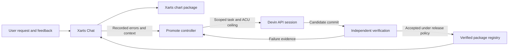

# Xarts and Promote: the product and its engineering team

Xarts turns structured data and a specification into a usable chart. Promote turns evidence from an application into engineering work, checks the result and records the decision to release it. They are separate projects with different responsibilities.

## Xarts: a visual engine for data

**Xarts by Anlak** is the chart library in the `visx-anlak` repository. An application supplies data, column bindings and a `ChartSpec`; Xarts prepares the data and renders the selected form. Its tooling supports interactive charts, standalone SVG, document composition and printable card decks.

The useful promise is consistency: the numbers, labels and geometry should agree across the interactive view and the exported artifact. Schema checks, numerical tests, measured layout checks, render comparisons and installed-package consumer tests cover different parts of that promise. A passing screenshot comparison alone does not prove that the calculation is correct.

**Xarts Chat** is the application around the library. It lets a user request a chart, inspect data and give feedback. It records runs and tool activity that Promote can investigate. The application, the chart package and the maintenance controller remain separate repositories.

Xarts has its own licensing and distribution terms. This public document describes the integration; it does not include the library's source, datasets or generated wiki export, and Promote's license does not grant rights to Xarts.

## Promote: an accountable engineering loop

**Promote** gathers errors and feedback, groups them into work, and dispatches scoped tasks through the Devin API. A task carries a repository, permitted scope and budget. Devin returns a candidate; Promote's evaluator checks that candidate separately.

The office is a view of this work: the whiteboard shows the backlog, the workstation shows engineering progress, the QA line shows verification, and the safe shows financial records. The operations journal exposes the evidence, blockers and decisions behind those views. Unknown costs and checks that have not run remain unknown.

The owner sets the operating boundaries and handles decisions that exceed them. Calling the agent a CEO is the product metaphor: it does not give a model unrestricted authority over spending, credentials or releases.

## How the projects work together

For example, a narrow chart may fail because its axis labels no longer fit. Promote can preserve that incident, request a library repair, and require a regression test plus an installed-package check. Fixing the shared layout code can help future charts too. A candidate that changes unapproved paths or fails verification must not be treated as a successful repair.

## What exists, and what still needs proving

| Capability | Current scope |
| --- | --- |
| Intake and work tracking | Durable application records, triage, proposals and controller history. |
| Engineering | Devin API sessions with explicit scope, budget reservations and recorded prompt identity. |
| Verification and delivery | Candidate validation, sandboxed checks and Xarts registry activation code. An individual release still needs its own complete evidence. |
| Owner controls | Decisions and a merge desk that checks the exact PR head and executed CI results. |
| Exploratory testing | An owner-launched Devin test session, a bounded budget and an evidence report. The initial Xarts Chat profile uses isolated UI fixtures; it does not certify live model or SDK behavior. |
| Office and Studio | A visual operations surface and a separate workflow for designing and reviewing office assets. Generated models are local previews, not bundled public assets. |
| General reuse | Provider and project adapters are separated. A new library still needs an adapter, meaningful checks and a release policy. |

This is an implemented development preview, not a claim that arbitrary repositories can maintain themselves unattended. Provider reports are evidence to investigate, not a substitute for independent checks.

## Read further

- [Promote setup and product overview](../README.md)
- [Exploratory testing and its limits](EXPLORATORY-TESTING.md)
- [Controller storage](controller-storage.md)
- [Engineering operations](devin-operations.md)
- [Xarts delivery](xarts-delivery.md)
- [Repository boundaries](repository-boundaries.md)
- [Xarts Chat repository](https://github.com/miguelsuredasuau/xarts-chat)
- [Xarts repository](https://github.com/miguelsuredasuau/visx-anlak) — access and licensing apply.

Prepared from the supplied DevinWiki snapshots and checked against the repositories on September 20, 2026. The wiki snapshots are reference material, not the authoritative record of implementation or release status.
